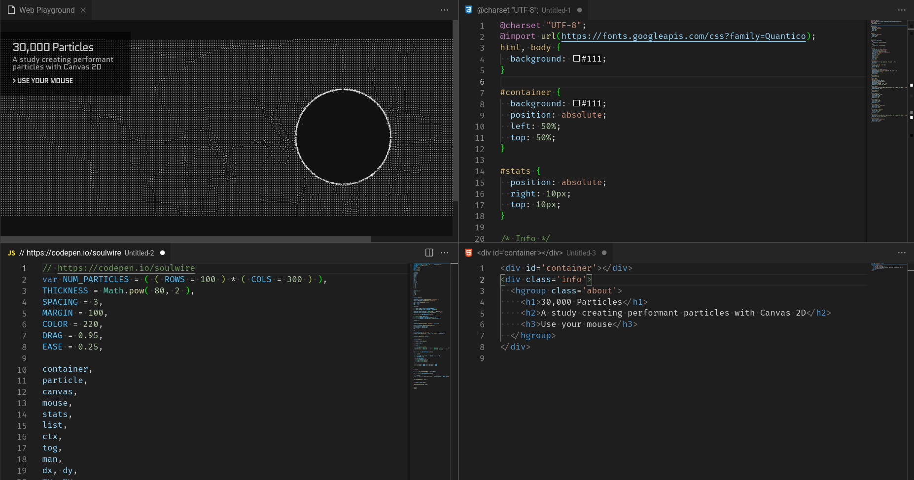

# Web Playground

> Fiddle around with web tech in VSCode!

- CSS / SCSS
- HTML
- JavaScript



## Usage

- `Ctrl` + `Shift` + `P`
- `webplayground`

**Optional steps**

- `Ctrl` + `b` to hide sidebar
- `webplaygroundclose` to free the extension

## Debug

`F5` in VSCode

## Local build/install

```
$ npm install -g vsce
$ vsce login {user}
$ vsce package
$ code --install-extension vscode-web-playground-{version}.vsix
```

### Uninstall

- `Ctrl` + `Shift` + `X`
- Search and uninstall

## Core functionality

Making use of the built-in webview which renders the following HTML

```
<!DOCTYPE html>
<html lang="en">
  <head>
    <meta charset="UTF-8">
    <meta name="viewport" content="width=device-width, initial-scale=1.0">
    <style>
      { CSS }
    </style>
  </head>
  <body>
    { HTML }
    <script type="text/javascript">
      { JavaScript }
    </script>
  </body>
</html>
```

## TODO

- haml/ts
- libraries (vue/angular/react/bootstrap)
- Export to jsfiddle/codepen/jsbin
